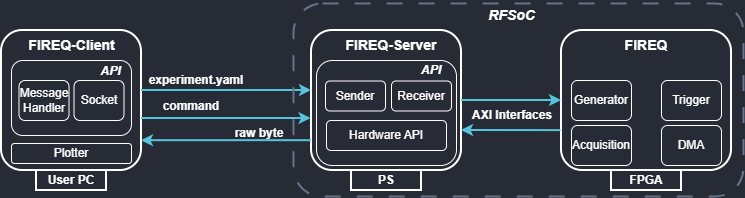

# Welcome to FIREQ

The FPGA Instrumentation for Readout and Qubit control (FIREQ) is a flexible platform for quantum-control experiments built around RFSoC hardware. It combines a high-level interface, a runtime service, and custom firmware into a unified workflow for generating signals, acquiring data, and coordinating complex experiment sequences with low latency.



---

## What is FIREQ?

FIREQ is composed of three main components:

* **[Client](components/client.md)**: Python-based interface used to define experiments, submit commands, and manage execution.
* **[Server](components/server.md)**: Backend service running on the target platform (supports ZCU216), exposing functionality to the client.
* **[Firmware](components/firmware.md)**: Low-level hardware implementation responsible for acquisition, generation, triggering, and timing.

---

## Documentation Index

Explore the documentation sections to get started or dive deep into specific components:

* **[Getting Started & Quick Start](getting_started.md)**: Board setup, SD card preparation, and your first experiment run.
* **[Client Documentation](components/client.md)**: Experiment definitions, plotting, and command reference.
* **[Server Documentation](components/server.md)**: Deployment, Hardware API/Driver layer, and runtime usage.
* **[Firmware Documentation](components/firmware.md)**: FPGA architecture, AXI interfaces, and register mapping.
* **[Project Info & Paper](project_info.md)**: Publications, repository links, and support channels.

```{toctree}
:maxdepth: 2
:hidden:

getting_started
components/client
components/server
components/firmware
project_info